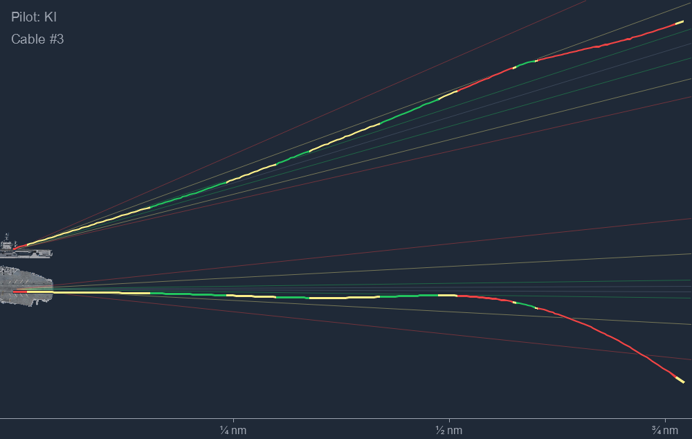
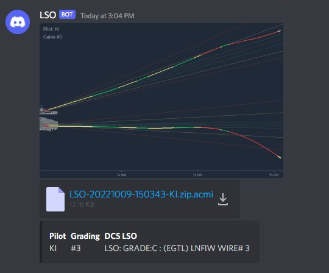

# LSO

LSO is a tool to analyze carrier recoveries in DCS. It connects to DCS via [DCS-gRPC](https://github.com/DCS-gRPC/rust-server) and generates reports for each attempted carrier recovery. The reports are saved to disk and optionally send to Discord.



**Status:** LSO is in a very early state. For now, it only detects the caught cable, and creates a visual report that includes the AOA of the recovering aircraft (color of the path) as well as the offset from the optimal glide path (the lines that fan out from the carrier both horizontally and vertically). It is planned to extend the LSO with a proper grading in the future and even generate a Discord-based greenie board.

**Supported Units:**
- Aircraft: F/A-18C, F14A, F14B, T45
- Carriers: CVN-71, CVN-72, CVN-73, CVN-74, CVN-75, CV-59

## Usage

The DCS server the LSO should connect to must have [DCS-gRPC](https://github.com/DCS-gRPC/rust-server) version `0.7` (unreleased, so requires [`main` branch](https://github.com/DCS-gRPC/rust-server/tree/main/) for now) installed and running.

To run the LSO, just execute the CLI in your favorite terminal:

```bash
.\lso.exe run
```

The CLI will create two files for each observed recovery attempt. A `.png` file containing the visual report, and a `.zip.acmi` file containing a track of the recovery. The latter can be opened with [TacView](https://www.tacview.net/). The files are saved in the same directory the CLI is executed in, or to the directory that is specified with the `-o`/`--out-dir` option.

The CLI connects to `http://127.0.0.1:50051` by default. You can change the URI with the `--uri` flag, if your DCS-gRPC instance is running on another host or port.

You can optionally send the reports to Discord by specifying a Discord webhook URL via `--discord-webhook https://discord.com/api/webhooks/YOUR_WEBHOOK`.



If you want to match DCS player names to Discord users to mention them directly, you can create a JSON file (e.h. `users.json`) with a player name to Discord user ID (right click the Discord user and select _Copy ID_) mapping. Example:

```json
{
  "Pilot Name A": 12345,
  "Pilot Name B": 678990
}
```

Activate the mapping with the `--discord-users` option (e.g. `--discord-users users.json`).

For all options, check the help of the CLI:

```bash
.\lso.exe --help
.\lso.exe run --help
```
